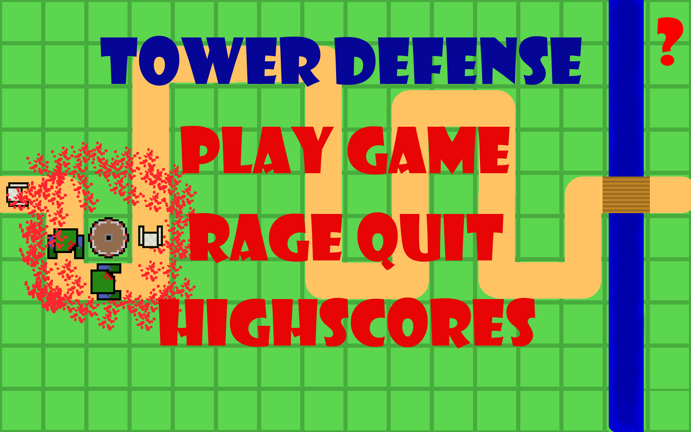

# High_School_Tower_Defense

This was my first coding project that wasn't a coding exercise and it showed me how much fun coding can be. It is a tower defense game that I co-developed as part of a five-man group during our 11th year of high school. The only restriction our teacher gave us was the time frame, but besides that we were free to use our full creativity for the first time. It really made me aware of how much more exciting project work can be compared to regular coding exercises.

I came up with the idea and managed to convince the team to create a tower defense game. As Java was the only programming language we had learned in high school, we planned and built the game completely from scratch. Three members of our team (including me) coded the game while the other two produced the required picture assets. I was responsible for developing the wave management system as well as the enemy and tower superclasses and about half of their derivatives.

We showcased our game at the high school summer open day and it was a huge success. For this purpose, one of my teammates implemented a server-side highscore board which allowed us to link up the highscore for every PC in the showcase room. However, at the time of writing I'm not in the possession of the server code.
>The `FEHLER! KEINE IP` error on the console can be ignored.

## How to run

The game can be run by executing the `TD_Game.jar` file, however it depends on the images in the `bilder` directory. If something doesn't work run it over the command line to check for errors and make sure you have the latest Java version installed as I compiled the jar recently. Instructions for the game can be found by clicking on the question mark.

I'm not sure if this is the final version of the game as I seem to recall that we had more curated waves and a higher overall difficulty at the showcase, but I might be wrong about that.
>Note: The game is coded in German but the instructions are in English
